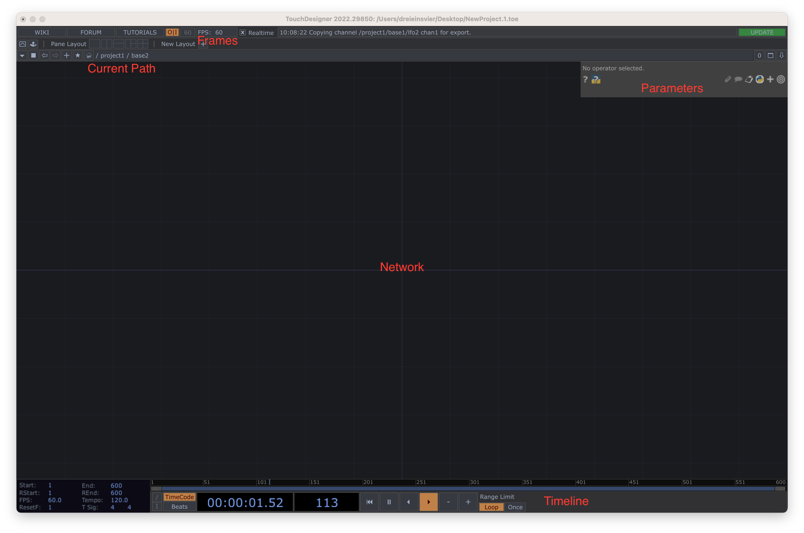
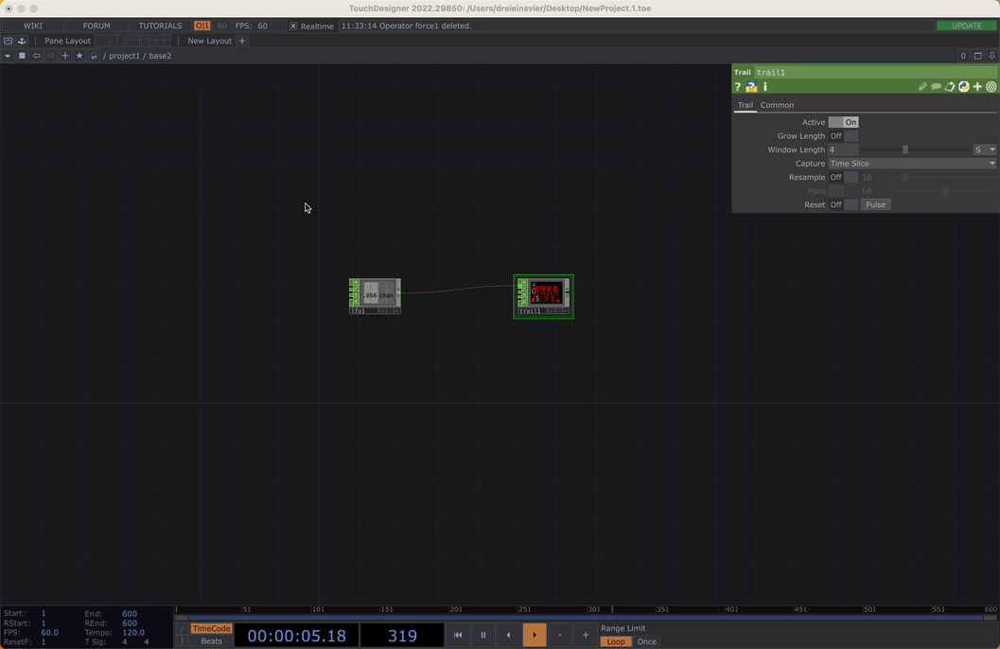
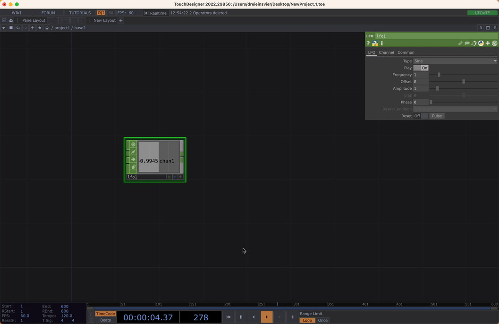
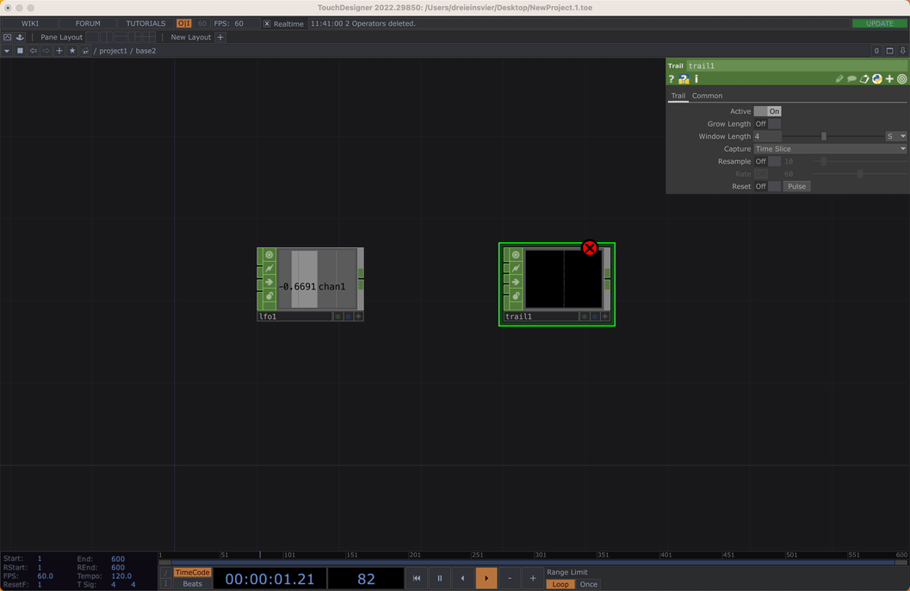
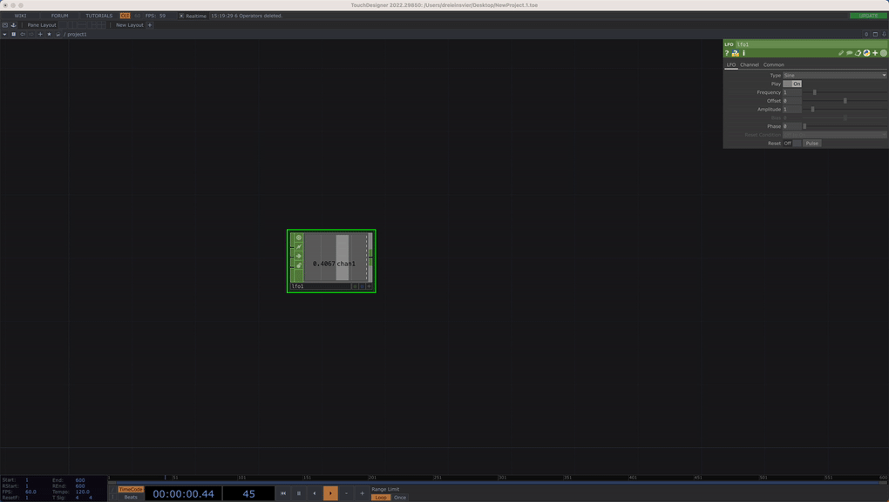

# TouchDesigner Introduction Course

Welcome to my TouchDesigner Course. In this course you will be learning some basic functionality of TouchDesigner.

TouchDesigner is a node based visual programming interface. So "apps" are not written with code, but by connecting nodes with each other. It already ships with a lot of functionality. There are nodes for common media communication protocols as well as a powerful 3D Rendering Pipeline.

Furthermore TouchDesigner supports the scripting language Python and everything inside TouchDesigner is programable with it.

To get a sense for the possibilities of TouchDesigner, i made this little overview:

- Generative Design ( Parametric Design, Noise )
- ( Network ) Protokols ( DMX, ARTNET, OSC, MIDI )
- 3D ( Vertex Operations, Shading, Materials )
- Shader ( 2D Effects )
- Interactivity ( Sensors, Arduino )
- User Interfaces ( GUI Building, Binding )
- Web Technologies ( Websockets, Webrender )
- Pointclouds ( Kinect, 3D Cameras )
- Audio ( Analyses, Design, Reactivity )
- VR ( Oculus, Vive, Open VR )
- Interoperability with other Software ( SYPHON Texture Sharing, Unity, Blender, Ableton Link )

But because TouchDesigner lets you program everthing, the possibilities are not tied to these usecases. Yet TouchDesigner has a focus on "multimedia programming".

## Introduction

In the following section you will find some useful info about TouchDesigner. I tried to focus on some basic points. But there are good resources from Derivative ( The company developing TouchDesigner ) as well, that will help you if this document is not sufficient.

Here are some useful links:

[Derivative Website](https://www.derivative.ca)

[TouchDesigner User Guide](https://derivative.ca/UserGuide/)

[TouchDesigner Wiki](https://docs.derivative.ca/Main_Page)

[TouchDesigner Forum](https://forum.derivative.ca)

[Common Operations - Matthew Ragan ](https://matthewragan.com/teaching-resources/touchdesigner/touchdesigner-common-operations-cheat-sheet/)

## The Interface

The Interface of TouchDesigner maybe looks a little antique, but has some very useful features like drag and drop etc.

First a little overview about the basics:

**Network**: This is where the Nodes are placed and connected, basically your canvas. A collection of Nodes is called network too.

**FPS**: This show you the current frames per second of TouchDesigner. TouchDesigner always tries to achieve the set FPS for the project. But should your Network need more performance ( because e.g. your computer is not capable enough ), then TouchDesigner will drop frames

**Timeline**: The Timeline can be used to animate things, but it also controls TouchDesigner Main Loop. Stopping the Timeline will stop TouchDesigner calculating anything.

**Parameters**: The Parameters show the settings per Node. They differ from Node to Node.

**Current Path**: Shows the path of the current position in the project. CAn be used to navigate.

### Interaction

**Pan**

By clicking with the left mouse into the network you you pan the network around

**Zoom**

Too zoom, either use the scrollwheel or option + right click

**Select**

To select use the right mouse

## Operators

Nodes in TouchDesigner are called Operators. There are different types of Operators in TouchDesigner:

**TOPS**: Texture Operators are 2D Shaders on the GPU and can operate on Textures.

**CHOPS**: Channel Operators process values. Every channel can consist out of 1 - n samples.

**SOPS**: Surface Operators work with 3D Geometry

**DATS**: Data Operators are text based Nodes, mainly for scripting (python)

**MATS**: Materials modify the shading of a 3D Geometry

**COMPS**: Components do have different functionalities. They can host networks, build UIs or have special functions.

### Working with Operators

---

**Adding OPs** OP Create Dialog

It gives you access to all the operator types, just click on a name and then click anywhere on a Network Editor Pane to place it in the network.

Select the Operator Family from the headings COMP TOP CHOP SOP MAT DAT.

**Generators** (types with no inputs) are shown using a darker shade, and **Filters** are the lighter shade of the OP color.

**Generators** Produces values oand therefore only have outputs.

**Filters** manipulate values und therefore have input and outputs.

You can start typing the name of the OP type you are looking for. Any OP-type that matches the string you’ve typed will highlight in white. For example, type midi and all the OP types starting with midi will turn white.

---

**Settings Operator Parameters**

**Paramters** show all the possible settings of an Operator. As we see later those Parameters can be modified with **Links**. Parameters can be toggles with the hotkey _p_.

Parameters can be reset by either right clicking on the Operator and select _Reset all Parameters_ or by right clicking on the parameter to reset it individually.

---

**Connecting OPs**

There are two possible ways to connect Operators. By **Wires** and by **Links**.

**Wires** only work within a OP Family and can only be used from an output ( source ) of a node to an input ( sink ) of a node. Wires have the same color as the Operator Family.

Mostly all inputs of a Node do have different purposes. The top most input is the most important though.

( the inputs of the trail node in this example do all have the same function, which is rather rare in TouchDesigner. )

https://docs.derivative.ca/Wire

**Links** are the second way to connect Operators. They are by far more complex and can be used to either modify parameters of an Operator oder reference another Operator. For parameters this also works across Operator Families while for referencing this only works within a family.

The most common way to create a **Link** is a python expression from an Operators Viewer. To do that it is recommended to connect the Operator to a "Null" Operator first and then toggle the Viewer of an Operator active to export the **Link**.

https://docs.derivative.ca/Link

### Operator Snippets

Operator Snippets are a great collections of samples provided by Derivative. If you need examples for an Operator try first to check the Operator Snippets. Unfortunately there is not an example for every Operator.

To open the Operator Snippets right click on an Operator and select Operator Snippets.

Your can also open Operator Snippets via the Help Menu.

## Some useful Shortcuts

**U** Up in the Network

**I** In a Network

Both also works by scrolling in and out a Network

**H** Home Everything, also works in Viewers **important**

**Shift + H** Home selected Operators

**A** Activate a Viewer

### Here is also a Cheat Sheet with more Shortcuts

